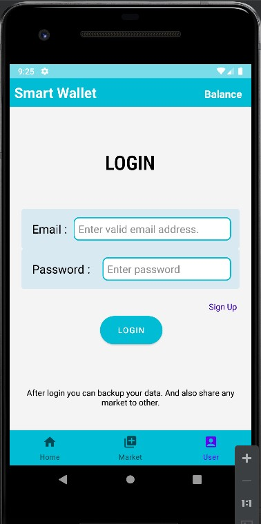

# Smart_Wallet_for_Students
This app not like an online banking system, it just store records of our current balance in easer way. Though It can do using ‘keep notes’ but ‘keep notes’ can’t calculate ‘total spend’, ‘current balance’, etc. Here user estimate will separate with each month. And user can create temporary estimation like instance market and this estimation totally separated from the user main estimate.   
Another feature is, User can share any of estimation with one or more users.    
# Target Users : 
Any person who are curious about their spending. 
# Proposed Problem and Solution : 
Now a days money management is an one of the hardest problem. This application will help us by showing overview in every spending. Make easy to tracking our every spending.  
And parents or guardian will easily track our spending estimation.   
# Goal : 
Some smart peoples to make money management are write there estimate in draft paper like diary, note etc. But this application will make this job as easy as	   possible. And encourage regular people to make money management. 

        

